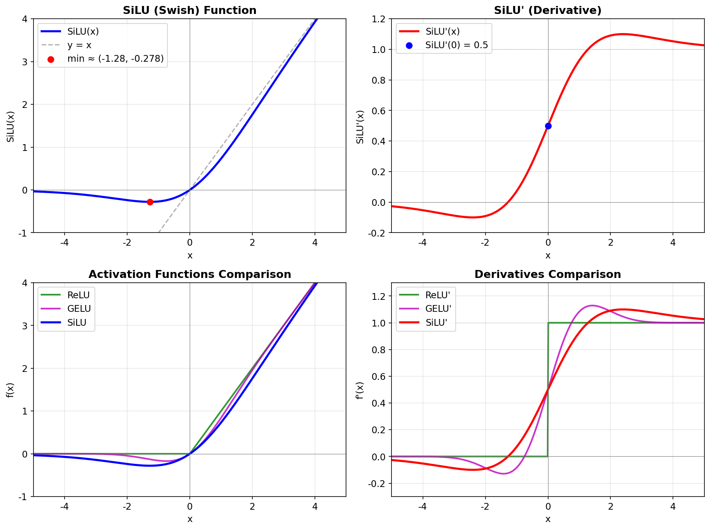

# SwiGLU (Swish-Gated Linear Unit)

## 概述

SwiGLU 是一种用于 Transformer FFN 层的激活函数，结合了 Swish 激活和门控线性单元（GLU）机制。

$$\sigma(x) = \frac{1}{1 + e^{-x}}$$

## SiLU (Swish) 函数图像与导数

### 函数与导数公式

$$\text{SiLU}(x) = x \cdot \sigma(x) = \frac{x}{1 + e^{-x}}$$

$$\text{SiLU}'(x) = \sigma(x)(1 + x(1 - \sigma(x)))$$

### 函数曲线



> 图片由 `scripts/plot_silu.py` 生成

### 关键点数值

| x | σ(x) | SiLU(x) | SiLU'(x) |
|---|------|---------|----------|
| -4 | 0.018 | -0.071 | 0.005 |
| -2 | 0.119 | -0.238 | 0.090 |
| -1.28 | 0.218 | **-0.278** (最小值) | 0 |
| -1 | 0.269 | -0.269 | 0.072 |
| 0 | 0.500 | 0 | 0.500 |
| 1 | 0.731 | 0.731 | 0.928 |
| 2 | 0.881 | 1.762 | 1.090 |
| 4 | 0.982 | 3.928 | 1.054 |

### 特征总结

- SiLU 过原点，x→+∞ 时趋近 y=x，x≈-1.28 处有最小值≈-0.278（非单调）
- 导数恒 > 0（x→-∞ 时趋近0但不为0），无"死神经元"
- 导数在 x=0 处值为 0.5，可超过1（轻微放大信号）

---

## 为什么会出现 SwiGLU

### FFN 激活函数的演化路径

```
ReLU → GELU → GLU → SwiGLU
```

**1. ReLU 时代的问题：**

原始 Transformer 的 FFN 使用 ReLU：

$$\text{FFN}(x) = \text{ReLU}(xW_1)W_2$$

问题：
- ReLU 在负半轴梯度为零（"死神经元"问题）
- 不平滑，零点处不可导
- 大规模训练中，大量神经元可能永久"死亡"

**2. GELU 的改进：**

$$\text{GELU}(x) = x \cdot \Phi(x) \approx x \cdot \sigma(1.702x)$$

GELU 是平滑的、处处可导的，BERT/GPT-2 开始采用。但本质上仍是**逐元素激活**，没有引入维度间的交互。

**3. GLU 的突破性思路：**

Dauphin et al. (2017) 提出 GLU（Gated Linear Unit）：

$$\text{GLU}(x) = (xW_1) \otimes \sigma(xW_2)$$

核心创新：**让网络自己决定哪些信息通过**。$\sigma(xW_2)$ 是一个可学习的门控，逐元素控制 $xW_1$ 的信息流。这引入了**两个不同视角**对同一输入的交互。

**4. SwiGLU = Swish + GLU：**

Shazeer (2020) 尝试了多种 GLU 变体（ReGLU、GEGLU、SwiGLU），发现用 Swish 替代 sigmoid 作为门控激活效果最好：

$$\text{SwiGLU}(x) = \text{Swish}(xW_1) \otimes (xW_2)$$

PaLM (2022) 大规模验证了 SwiGLU 在数千亿参数下的有效性，LLaMA (2023) 采用后成为开源标准。

## 公式

$$\text{SwiGLU}(x) = \text{Swish}(xW_1) \otimes (xW_2)$$

其中：
- $\text{Swish}(x) = x \cdot \sigma(x)$，其中 $\sigma(x) = \frac{1}{1 + e^{-x}}$
- $W_1, W_2$ 为两个不同的线性投影矩阵
- $\otimes$ 为逐元素乘法

## FFN 结构对比

**标准 FFN (ReLU):**
$$\text{FFN}(x) = \text{ReLU}(xW_1 + b_1)W_2 + b_2$$

**SwiGLU FFN:**
$$\text{FFN}_{SwiGLU}(x) = (\text{Swish}(xW_1) \otimes xW_2) W_3$$

注意：SwiGLU 引入了第三个权重矩阵，为保持参数量一致，通常将中间维度设为 $\frac{8}{3}d_{model}$（而非标准的 $4d_{model}$）。

### 参数量对比

| FFN 类型 | 权重矩阵 | 中间维度 | 总参数量 |
|---------|---------|---------|---------|
| 标准 ReLU | $W_1, W_2$ | $4d$ | $2 \times d \times 4d = 8d^2$ |
| SwiGLU | $W_1, W_2, W_3$ | $\frac{8}{3}d$ | $3 \times d \times \frac{8}{3}d = 8d^2$ |

通过缩小中间维度，SwiGLU 在相同参数量下获得更强的表达能力。

## 为什么 SwiGLU 有效

### 1. 门控机制引入了"信息选择"能力

标准 FFN 中，所有维度被同一个激活函数统一处理（ReLU 要么通过要么截断）。SwiGLU 引入了**两条路径**：

```
路径1: Swish(xW₁)  → "值"路径，提供候选激活
路径2: xW₂         → "门"路径，决定放行哪些信息
```

两条路径对同一输入做不同的线性变换，然后逐元素相乘，相当于**网络自适应地选择哪些特征是重要的**。这比 ReLU 的硬截断或 GELU 的固定概率截断灵活得多。


## 实现代码

### PyTorch 实现

```python
import torch
import torch.nn as nn
import torch.nn.functional as F


class SwiGLU(nn.Module):
    """SwiGLU 激活函数模块"""
    def forward(self, x: torch.Tensor) -> torch.Tensor:
        x1, x2 = x.chunk(2, dim=-1)
        return F.silu(x1) * x2  # silu = swish


class FeedForward(nn.Module):
    """带 SwiGLU 的 FFN 层（LLaMA 风格）"""
    def __init__(self, dim: int, hidden_dim: int = None, multiple_of: int = 256):
        super().__init__()
        # 默认 hidden_dim = 8/3 * dim，向上取 multiple_of 的整数倍
        if hidden_dim is None:
            hidden_dim = int(2 * (4 * dim) / 3)
            hidden_dim = multiple_of * ((hidden_dim + multiple_of - 1) // multiple_of)

        self.w1 = nn.Linear(dim, hidden_dim, bias=False)  # gate projection
        self.w2 = nn.Linear(hidden_dim, dim, bias=False)  # down projection
        self.w3 = nn.Linear(dim, hidden_dim, bias=False)  # up projection

    def forward(self, x: torch.Tensor) -> torch.Tensor:
        # SwiGLU: Swish(xW1) ⊗ (xW3)，然后下投影 W2
        return self.w2(F.silu(self.w1(x)) * self.w3(x))
```

### 各激活函数 FFN 的统一对比实现

```python
class FFN_ReLU(nn.Module):
    """标准 ReLU FFN"""
    def __init__(self, dim, hidden_dim=None):
        super().__init__()
        hidden_dim = hidden_dim or 4 * dim
        self.w1 = nn.Linear(dim, hidden_dim, bias=False)
        self.w2 = nn.Linear(hidden_dim, dim, bias=False)

    def forward(self, x):
        return self.w2(F.relu(self.w1(x)))


class FFN_GELU(nn.Module):
    """GELU FFN (GPT-2/BERT 风格)"""
    def __init__(self, dim, hidden_dim=None):
        super().__init__()
        hidden_dim = hidden_dim or 4 * dim
        self.w1 = nn.Linear(dim, hidden_dim, bias=False)
        self.w2 = nn.Linear(hidden_dim, dim, bias=False)

    def forward(self, x):
        return self.w2(F.gelu(self.w1(x)))


class FFN_SwiGLU(nn.Module):
    """SwiGLU FFN (LLaMA/DeepSeek 风格)"""
    def __init__(self, dim, hidden_dim=None):
        super().__init__()
        hidden_dim = hidden_dim or int(2 * (4 * dim) / 3)
        self.w1 = nn.Linear(dim, hidden_dim, bias=False)
        self.w2 = nn.Linear(hidden_dim, dim, bias=False)
        self.w3 = nn.Linear(dim, hidden_dim, bias=False)

    def forward(self, x):
        return self.w2(F.silu(self.w1(x)) * self.w3(x))
```

### 关键实现细节

| 细节 | 说明 |
|------|------|
| `F.silu` | PyTorch 中 Swish 的官方名称（SiLU = Sigmoid Linear Unit = Swish） |
| `bias=False` | LLaMA 风格去掉所有 bias |
| `w1` vs `w3` | w1 是门控路径（过 Swish），w3 是值路径（线性通过），w2 是下投影 |
| `multiple_of=256` | hidden_dim 对齐到 256 的倍数，利于 GPU tensor core 对齐 |
| 中间维度 $\frac{8}{3}d$ | 三个矩阵 vs 两个矩阵，缩小中间维度保持参数量一致 |

### 命名注意

不同代码库中 w1/w2/w3 的命名容易混淆：

```python
# LLaMA 命名:
#   w1 = gate_proj   (dim → hidden_dim, 过 Swish)
#   w3 = up_proj     (dim → hidden_dim, 线性)
#   w2 = down_proj   (hidden_dim → dim, 输出)

# HuggingFace 命名:
#   gate_proj = w1
#   up_proj   = w3
#   down_proj = w2

# 计算: down_proj( silu(gate_proj(x)) * up_proj(x) )
```

## 优势总结

1. **性能提升**：相比 ReLU/GELU，在语言建模任务上持续表现更优
2. **门控机制**：允许网络学习性地控制信息流通，表达能力更强
3. **平滑性**：Swish 的平滑特性有利于优化，无"死神经元"问题
4. **二阶表达**：逐元素乘法引入特征交互，单层拟合能力更强
5. **梯度友好**：双路径结构保证梯度流通

## 应用场景

- LLaMA、DeepSeek LLM、PaLM 等模型的 FFN 层
- 已成为现代大语言模型 FFN 层的默认选择

## 参考文献

- Shazeer, N. (2020). GLU Variants Improve Transformer.
- Dauphin, Y., et al. (2017). Language Modeling with Gated Convolutional Networks.
- Ramachandran, P., et al. (2017). Searching for Activation Functions (Swish).
